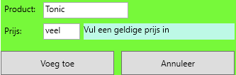

# PE: Drankenautomaat
## Lay-out
Maak een lay-out zoals hieronder afgebeeld (gebruik gerust je eigen creativiteit):

Lay-out bij opstarten:

Lay-out na bestelling:

Lay-out voor beheer:

## Functionaliteiten
### Opstart
- Via lists worden de volgende gegevens bijgehouden
  - namen van dranken
  - prijzen van dranken
  - aantal verkochte exemplaren per drank
- De namen en prijzen van de dranken worden opgeladen in de linker listbox
- De waarden van de munten van 10 cent tot en met 2 euro worden opgeladen in de rechter listbox
- De listbox voor de inworp is enkel beschikbaar als er effectief een product is gekozen
- De grid voor het beheer is niet zichtbaar
### Een drank toevoegen
- Door een klik op de knop 'Beheer' wordt de grid met de controls voor het beheer zichtbaar.
De grid voor de bestellingen is niet beschikbaar.
- Bij een klik op 'Voeg toe' wordt een product en zijn prijs toegevoegd, tenzij in de textbox voor de prijs geen geldig getal staat.

- Na het toevoegen of bij een klik op 'Annuleer', wordt het beheerscherm verborgen en wordt de grid voor de bestellingen terug bruikbaar.
### Een drank bestellen
- Als er een product geselecteerd wordt, worden het te betalen bedrag en het saldo getoond.
- De gegevens van de vorige bestelling worden gewist.
### Een bestelling annuleren
Bij een klik op de knop 'Annuleer Bestelling' 
### Betalen
- Bij elke klik op een bedrag, wordt het te betalen saldo bijgewerkt.
- Eens het bedrag volledig betaald is:
  - Wordt het wisselgeld berekend en getoond.
  - Worden de statistieken bijgewerkt en getoond.
## Afspraken  
- Gebruik variabelen overal waar waarden opgeslagen worden. Gebruik geen instance variabele als dit niet strikt gezien nodig is. 
- Declareer de variabelen binnen de kleinst mogelijke scope.
- Werk zo veel mogelijk met methoden. Maak hierbij optimaal gebruik van parameters en return types.
- In een event handler method mogen er in principe enkel de volgende zaken voorkomen:
 - Declaratie van lokale variabelen
 - Inlezen van de input van de gebruiker
 - Toewijzen van waarden aan de variabelen (indien eenvoudig statement)
 - Call(s) naar eigen methoden
 - Feedback naar de gebruiker
## Score
- Het respecteren van de afspraken (zie vorig punt)
- De mate waarin de applicatie fool proof en gebruiksvriendelijk is. Hieronder verstaan we ook de validatie (checken of de gegevens correct/volledig zijn vooraleer ze opgeslagen worden) van gegevens.
- Algemene werking van de applicatie
- De leesbaarheid van de code
- Bestanden die fouten geven bij het uitpakken, solutions die bij de start compileerfouten geven, worden niet geëvalueerd = 0.

