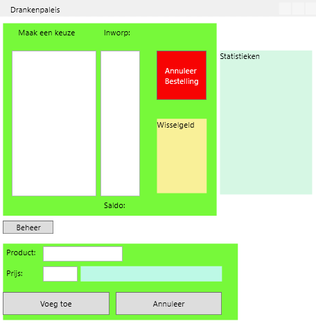
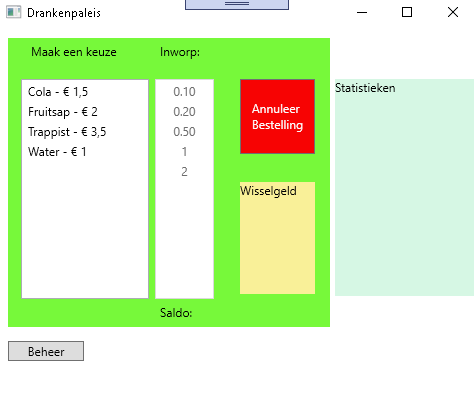
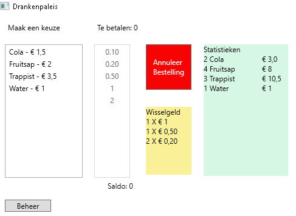
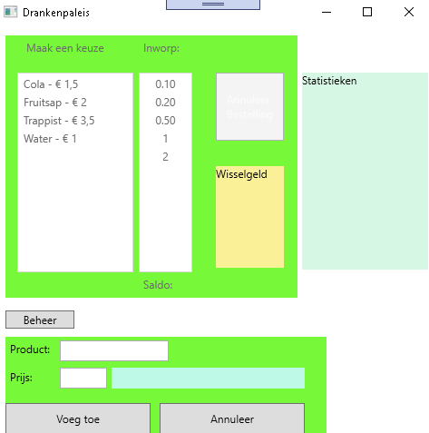

# PE: Drankenautomaat
## Lay-out
Maak een lay-out zoals hieronder afgebeeld (gebruik gerust je eigen creativiteit):

Lay-out bij opstarten:

Lay-out na bestelling:

Lay-out voor beheer:

## Functionaliteiten
### Opstart
- Via lists worden de volgende gegevens bijgehouden
  - namen van dranken
  - prijzen van dranken
  - aantal verkochte exemplaren per drank
- De namen en prijzen van de dranken worden opgeladen in de linker listbox
- De waarden van de munten van 10 cent tot en met 2 euro worden opgeladen in de rechter listbox
- De listbox voor de inworp is enkel beschikbaar als er effectief een product is gekozen
- De grid voor het beheer is niet zichtbaar
### Een drank toevoegen
- Door een klik op de knop 'Beheer' wordt de grid met de controls voor het beheer zichtbaar
- Bij een klik op 'Voeg toe' wordt een product en zijn prijs toegevoegd, tenzij in de textbox voor de prijs geen geldig getal staat.

### Een drank bestellen

- Maak zaken die niet nuttig zijn onzichtbaar of schakel die uit.
- 
